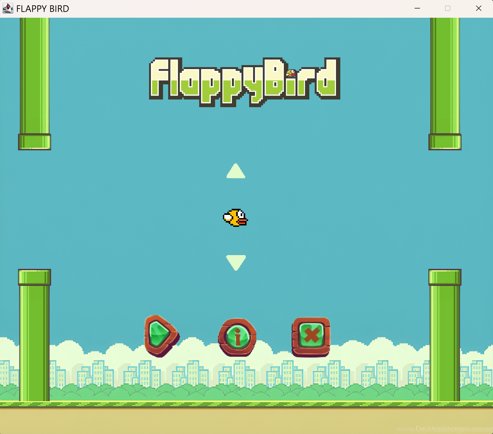
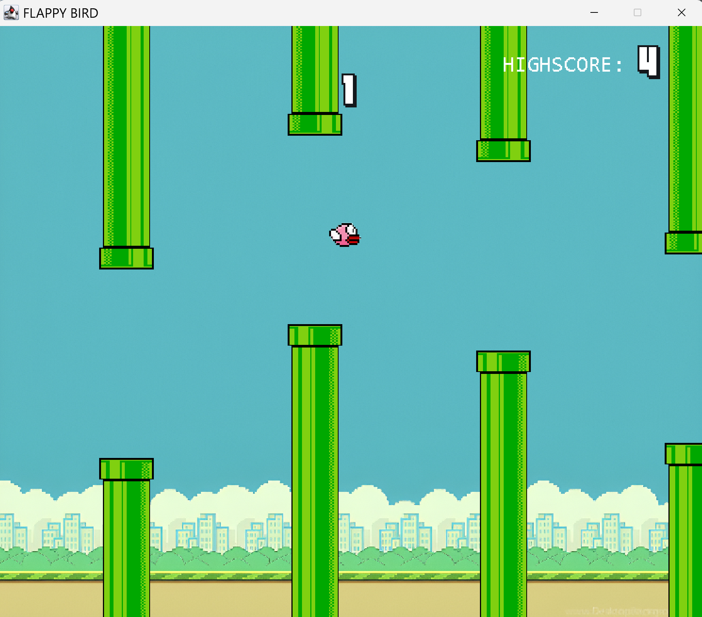
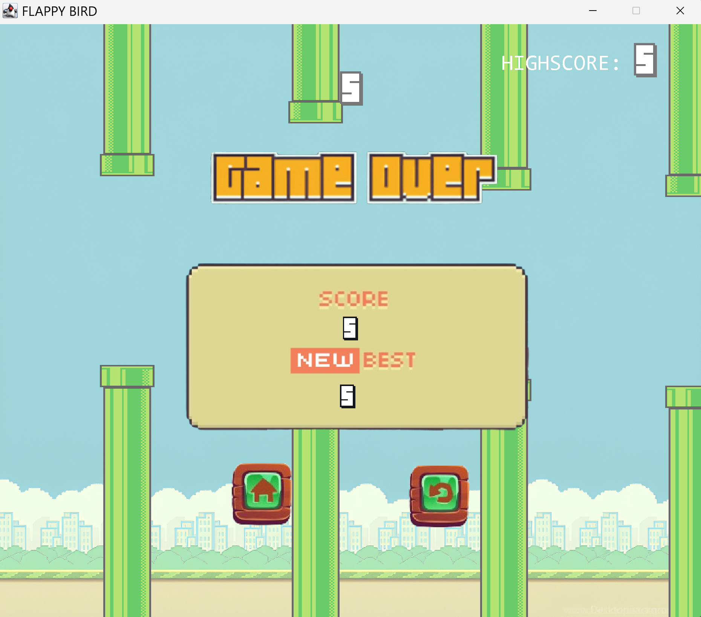
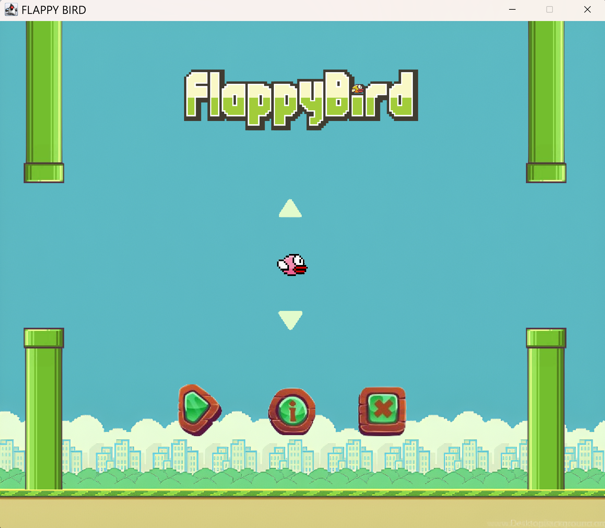

<h1 align="center">🐦 Flappy Bird — Java Edition</h1>

  A Flappy Bird clone built as a Java GUI project — featuring a main menu, difficulty levels, bird color customization, and music.

  
  
  

 

### 🎮 Features

- 🏠 Main menu with clean UI
- 🎯 Difficulty levels — speed increases as you progress
- 🎨 Bird color customization
- 🔊 Volume control *(coming soon)*
- 🎵 Background music & sound effects
- 🏆 Score tracking

 

### 🚀 How to Run

1. Make sure **Java** is installed on your computer
2. Download or clone this repository
3. Open the project in **Eclipse IDE**
4. Run the main file

 

### 🛠️ Built With

- Java
- Java Swing
- Eclipse IDE

 

### 📸 Screenshots

  
    
  
    
  
    
  

 

Made with ❤️ — open source and free to learn from

